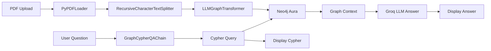

# Knowledge Graph Extraction and Graph Retrieval-Augmented Generation System

A production-ready **GraphRAG** application that extracts entities and relationships from PDF documents, stores them in **Neo4j Aura**, and answers natural-language questions using **Groq** (`llama-3.3-70b-versatile`) and the **LangChain** ecosystem.


---

## Features

- **Streamlit UI** — Modern, responsive interface for upload, progress tracking, and Q&A
- **PDF ingestion** — `PyPDFLoader` with metadata preservation
- **Smart chunking** — `RecursiveCharacterTextSplitter` for optimal context windows
- **Dynamic entity discovery** — No hardcoded entity types; LLM discovers nodes and relationships
- **Neo4j Aura integration** — Automatic graph persistence with optional pre-ingestion wipe
- **GraphRAG Q&A** — Natural language → Cypher → graph context → grounded answer
- **Transparency** — Returns both the generated Cypher query and the final answer
- **Graph analytics** — Node/relationship counts, labels, and sample entities

---

## Project Structure

```
project/
│
├── app.py              # Streamlit frontend
├── graph_builder.py    # PDF processing & knowledge graph construction
├── graph_query.py      # GraphRAG query engine (Cypher + answer generation)
├── config.py           # Environment-based configuration
├── requirements.txt    # Python dependencies
├── .env                # API keys and connection strings (not for production commit)
└── README.md           # This file
```

---

## Prerequisites

| Requirement | Details |
|-------------|---------|
| Python | 3.10 or higher |
| Groq API key | [console.groq.com/keys](https://console.groq.com/keys) |
| Neo4j Aura instance | [neo4j.com/cloud/aura](https://neo4j.com/cloud/aura/) |
| PDF document | Any text-based PDF for ingestion |

---

## Quick Start

### 1. Clone or download the project

```bash
cd project
```

### 2. Create a virtual environment

```bash
python -m venv venv

# Windows
venv\Scripts\activate

# macOS / Linux
source venv/bin/activate
```

### 3. Install dependencies

```bash
pip install -r requirements.txt
```

### 4. Configure environment variables

Edit the `.env` file in the project root:

```env
GROQ_API_KEY=gsk_your_actual_key
NEO4J_URI=neo4j+s://your-instance.databases.neo4j.io
NEO4J_USERNAME=neo4j
NEO4J_PASSWORD=your_neo4j_password
```

### 5. Run the application

```bash
streamlit run app.py
```

Open the URL shown in the terminal (typically `http://localhost:8501`).

---

## Groq API Integration Guide

### Step 1: Create a Groq account

1. Visit [https://console.groq.com](https://console.groq.com)
2. Sign up or log in
3. Navigate to **API Keys** → **Create API Key**
4. Copy the key (starts with `gsk_`)

### Step 2: Configure the application

Add your key to `.env`:

```env
GROQ_API_KEY=gsk_your_key_here
GROQ_MODEL=llama-3.3-70b-versatile
GROQ_TEMPERATURE=0.0
```

### Step 3: Verify the model

The default model is **Llama 3.3 70B Versatile**, which supports:

- 131K token context window
- Function calling (used by `LLMGraphTransformer`)
- Fast inference via Groq LPU hardware

To use a different Groq model, update `GROQ_MODEL` in `.env`. See [Groq supported models](https://console.groq.com/docs/models).

---

## Neo4j Aura Configuration Guide

### Step 1: Create an AuraDB instance

1. Go to [https://neo4j.com/cloud/aura](https://neo4j.com/cloud/aura/)
2. Click **Create Database** → **AuraDB Free** (or Professional)
3. Choose a region close to your users
4. Set a secure password and save it — it is shown only once

### Step 2: Copy connection details

From the Aura console, copy:

| Field | Example |
|-------|---------|
| URI | `neo4j+s://abcd1234.databases.neo4j.io` |
| Username | `neo4j` |
| Password | *(your chosen password)* |

> **Note:** Aura uses the `neo4j+s://` protocol (TLS-encrypted Bolt). Do not use `bolt://` for Aura.

### Step 3: Add credentials to `.env`

```env
NEO4J_URI=neo4j+s://abcd1234.databases.neo4j.io
NEO4J_USERNAME=neo4j
NEO4J_PASSWORD=your_secure_password
```

### Step 4: Verify connectivity

After starting the app, check the sidebar. A green **Configuration is valid** message confirms successful credential loading.

### Step 5: Optional — clear graph before ingestion

Enable **Clear graph before ingestion** in the sidebar to run:

```cypher
MATCH (n) DETACH DELETE n
```

before loading new documents. Use this when re-ingesting a fresh dataset.

---

## Usage Workflow

### 1. Upload & Build

1. Open the **Upload & Build** tab
2. Upload a PDF
3. Optionally enable **Clear graph before ingestion**
4. Click **Build Knowledge Graph**
5. Watch the progress bar as the system:
   - Loads and splits the PDF
   - Extracts entities and relationships per chunk
   - Stores the graph in Neo4j Aura

### 2. Ask Questions

1. Go to the **Ask Questions** tab
2. Enter a natural-language question
3. Click **Get Answer**
4. Review:
   - **Generated Cypher Query** — the LLM-produced Cypher
   - **Retrieved Graph Context** — data fetched from Neo4j
   - **Final Answer** — grounded response from the LLM

### 3. Graph Overview

1. Open the **Graph Overview** tab
2. View node count, relationship count, labels, and sample entities
3. Click **Refresh Statistics** after new ingestions

---

## Example Screenshots

> Replace these placeholders with your own screenshots after running the app.

### Upload & Build Tab

```
┌─────────────────────────────────────────────────────────────┐
│  Knowledge Graph GraphRAG System                            │
│  ─────────────────────────────────────────────────────────  │
│  [ Upload & Build ]  [ Ask Questions ]  [ Graph Overview ]  │
│                                                             │
│  Document Upload                                            │
│  ┌─────────────────────────────────────────────────────┐   │
│  │  Drag and drop PDF here                             │   │
│  └─────────────────────────────────────────────────────┘   │
│                                                             │
│  [ Build Knowledge Graph ]                                  │
│  ████████████████████░░░░░░░░  75%                          │
│  Extracting entities from chunk 6/8...                      │
└─────────────────────────────────────────────────────────────┘
```

### Ask Questions Tab

```
┌─────────────────────────────────────────────────────────────┐
│  Generated Cypher Query                                       │
│  ┌─────────────────────────────────────────────────────┐   │
│  │ MATCH (p:Person)-[r:FOUNDED]->(c:Company)           │   │
│  │ RETURN p.id, c.id, type(r)                          │   │
│  └─────────────────────────────────────────────────────┘   │
│                                                             │
│  Final Answer                                               │
│  The document describes Person X who founded Company Y...   │
└─────────────────────────────────────────────────────────────┘
```

### Graph Overview Tab

```
┌─────────────────────────────────────────────────────────────┐
│  Nodes: 42    Relationships: 67    Entity Labels: 8        │
│                                                             │
│  Node Labels: Person, Company, Product, Location, ...     │
│  Relationship Types: FOUNDED, WORKS_AT, LOCATED_IN, ...     │
└─────────────────────────────────────────────────────────────┘
```

---

## Architecture



### Module Responsibilities

| Module | Responsibility |
|--------|----------------|
| `config.py` | Loads and validates `.env` configuration |
| `graph_builder.py` | PDF → chunks → entities/relationships → Neo4j |
| `graph_query.py` | Question → Cypher → context → answer |
| `app.py` | Streamlit UI, session state, progress display |

---

## Deployment Instructions

### Local development

```bash
streamlit run app.py
```

### Streamlit Community Cloud

1. Push the `project/` folder to a GitHub repository
2. Go to [share.streamlit.io](https://share.streamlit.io)
3. Connect your repository
4. Set **Main file path** to `app.py`
5. Add secrets in the Streamlit Cloud dashboard:

```toml
GROQ_API_KEY = "gsk_..."
NEO4J_URI = "neo4j+s://..."
NEO4J_USERNAME = "neo4j"
NEO4J_PASSWORD = "..."
```

6. Deploy

### Docker (optional)

Create a `Dockerfile` in the project root:

```dockerfile
FROM python:3.11-slim

WORKDIR /app
COPY requirements.txt .
RUN pip install --no-cache-dir -r requirements.txt

COPY . .

EXPOSE 8501
CMD ["streamlit", "run", "app.py", "--server.port=8501", "--server.address=0.0.0.0"]
```

Build and run:

```bash
docker build -t graphrag-app .
docker run -p 8501:8501 --env-file .env graphrag-app
```

### Production recommendations

- Store secrets in a vault or cloud secret manager — never commit `.env`
- Use Neo4j Aura Professional for production workloads
- Set rate limits and monitor Groq API usage
- Add authentication in front of Streamlit for multi-user deployments
- Consider batching large PDFs to manage token costs

---

## Troubleshooting

| Issue | Solution |
|-------|----------|
| `Missing required environment variable` | Fill in all values in `.env` |
| Neo4j connection failed | Verify URI uses `neo4j+s://` for Aura |
| No graph data extracted | Ensure the PDF contains readable text (not scanned images) |
| Groq rate limit error | Reduce chunk size or add delays between chunk processing |
| Empty graph statistics | Build the graph first in the Upload & Build tab |

---

## Security Notes

- Never commit `.env` to version control
- Use read-only Neo4j users for query-only deployments when possible
- `allow_dangerous_requests=True` is required by LangChain for Cypher execution — restrict access in production
- Rotate API keys periodically

---

## License

MIT License — use freely for learning and production projects.
